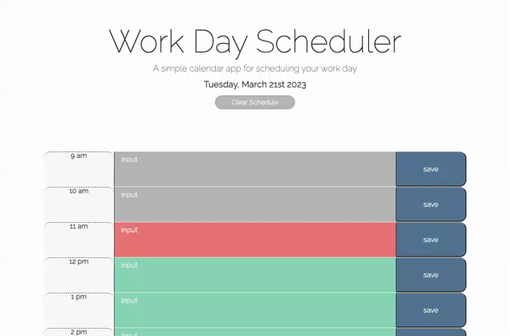

# Workday Scheduler
[Create your workday schedule!](https://overtonr.github.io/workday-scheduler/)

## Description:
This application is an hour-by-hour work day scheduler. Users can see the current date at the top of the page. They can also see a breakdown of their work day by hour. The save button ensures the events they input will be saved.




The save button saves the


## Usage: 
Navigate to the [deployed application](https://overtonr.github.io/workday-scheduler/).
The current date can be viewed at the top of the screen. There is an hour-by-hour breakdown of the day, in which users can input text such as an event or task. If the time slot is grey, that means the time has passed, red if it is the present hour, and green if it is in the future. 

Depending on the hour, the class added will color code the time slot:

```js
if(timeSlot == moment().format('HH')){
        $("textarea").addClass("present");
    } else if(timeSlot <moment().format('HH')) {
        $("textarea").addClass("past")
    } else {
        $("textarea").addClass("future")
    };
```


Users can also save the input to add an item to their hour-by-hour schedule.

```js
$(".saveBtn").on("click", function (event) {
  event.preventDefault();
  var task = {
    textValue: $(this).prev().val().trim(),
    index: event.target.previousElementSibling.getAttribute("id"),
  };
  localStorage.setItem(task.index, task.textValue);
});
```

The clear button allows the user to clear all items from their times slots and local storage:

```js
$("#clearBtn").on("click", function (event){
  $("textarea").val("input");
  localStorage.clear();
});
```

## Technologies Used:
* Github
* HTML
* CSS
* JavaScript
* JQuery
* Moment.js
* Bootstrap.js
* VS Code

## License 
Please refer to the license in the repository.